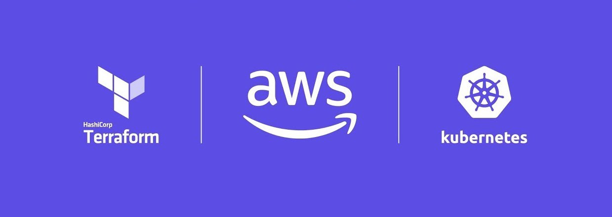

# EKS cluster with Terraform using existing VPC



### How to deploy EKS cluster with Terraform configuration files?

#### Step 1. Change directory to Terraform. Update backend.tf with relevant information for your environment. 

#### Step 2. Update terraform.tfvars file and add your VPC name. It is important because you will use existing VPC.
```bash
vpc_name = "YOUR_VPC_NAME"
```
#### Step 3.  If all files updated you can begin installation.
```bash
terraform init
terraform plan
terraform apply
```
#### Step 4. Change directory to Manifests. Update service-account.yaml file and add your VPC id. Create service account which has the correct IAM role annotations to get access S3 buckets.
```bash
eks.amazonaws.com/role-arn: arn:aws:iam::{replace with your aws account}:role/irsa-s3-readonly
```
```bash
kubectl apply -f service-account.yaml
```
#### Step 5. Create test pod to check S3 access
```bash
kubectl apply -f pod.yaml
kubectl exec -it test-pod -- bash
aws s3 ls
```
